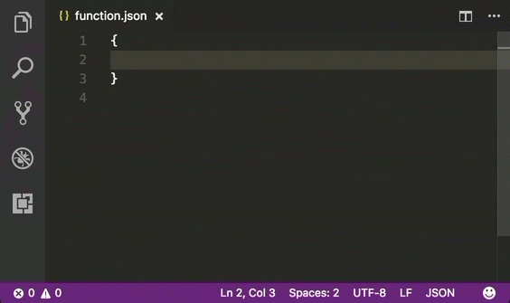

# Azure Functions Tools - Extensions for VS Code
 Azure Functions Tools - Extensions for VS Code

## Features
This extension for Visual Studio Code includes:

- JSON Intellisense for `host.json` and `function.json`

> We'll add other features in future versions

### JSON Schema Intellisense

Alternatively, press `Ctrl`+`Space` (Windows, Linux) or `Cmd`+`Space` (macOS) to activate intellisense from within the editor.

## Installation

1. Install Visual Studio Code 1.11.0 or higher
2. Launch Code
3. From the command palette `Ctrl`-`Shift`-`P` (Windows, Linux) or `Cmd`-`Shift`-`P` (macOS)
4. Select `Install Extension`
5. Choose the extension
6. Reload Visual Studio Code
